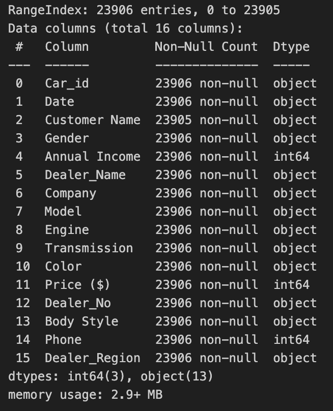

# Predicting Car Categories and Purchase Prices: A Machine Learning Approach to Consumer Behavior Analysis

## Project Overview

In 2023, there were 1.76 million cars sold in Canada which translates to around a 12.9% increase year over year. Thus understanding customer preferences and spending behavior is key to staying competitive and capturing some of this revenue. This project uses a clustering model to classify potential buyers into different car categories (SUV, Hatchback, etc.) by leveraging demographic data such as age, income, and gender. It also employs a regression model to forecast how much a customer might spend on a vehicle based on factors like income, region, and gender. Together, these provide valuable insights that will help businesses fine-tune their marketing and pricing strategies, ensuring they meet customer needs while maximizing profitability.

The questions this project aims to address are:

### 1. Car Category Prediction Using Machine Learning: Leveraging Demographic and Purchase Data for Classification

This part focuses on using classification techniques to classify which category of car (e.g., SUV, sedan) a customer is likely to purchase, based on demographic factors such as age, income, gender, and historical purchase data. The goal is to build an accurate predictive model that assists in understanding consumer preferences in car categories. This can be used by dealerships to taylor their marketing strategy to each customer group.

## Team Members (GitHub Username)

- Aadil Shaikh ([aadil-shaikh786](https://github.com/aadil-shaikh786))
- Felipe Bastos ([fbastos231](https://github.com/fbastos231))
- Shayan Hodai ([ShayanHodai](https://github.com/ShayanHodai))
- Si Jiao Liu ([sijiao-liu](https://github.com/sijiao-liu))
- Xuan (Heather) Wu ([lookatme818](https://github.com/lookatme818))

## Dataset

The dataset for this project is from Kaggle: [Car Sales Report Dataset](https://www.kaggle.com/datasets/missionjee/car-sales-report). It captures key aspects of automotive sales transactions, simulating various dimensions of car sales, including customer demographics, dealer information, and specific details about the vehicles. Below, we provide a detailed breakdown of the collected data and its relevance to our research objectives.

Attributes of the Dataset
The dataset contains the following key columns, each representing important information related to car sales:

- Car_id (String): Unique identifier for each car in the dataset.
- Date (Datetime): The date of the transaction (format: MM/DD/YYYY).
- Customer Name (String): Name of the customer who purchased the vehicle.
- Gender (String): Gender of the customer (e.g., Male).
- Annual Income (Integer): Annual income of the customer (in local currency).
- Dealer_Name (String): Name of the car dealership where the sale was made.
- Company (String): Manufacturer or company of the car (e.g., Ford, Cadillac).
- Model (String): The specific model of the car sold (e.g., Expedition, Eldorado).
- Engine (String): Type of engine (e.g., Overhead Camshaft, Double Overhead Camshaft).
- Transmission (String): Type of transmission (e.g., Auto, Manual).
- Color (String): The color of the vehicle sold (e.g., Black, Red).
- Price ($) (Integer): Price of the car in dollars.
- Dealer_No (String): Unique identifier for the dealership.
- Body Style (String): The body style of the vehicle (e.g., SUV, Hatchback, Passenger).
- Phone (String): Phone number associated with the dealership.
- Dealer_Region (String): Geographical region of the dealership (e.g., Middletown, Aurora).

## Data Exploration

### Descriptive Statistics (Numerical Features)

### Data Types and Null Values

There are 23,906 entries and 16 columns, including features such as car model, price, and annual income. Most of the features are categorical, and there are no significant missing values except for a single entry in Customer Name which is a feature we will not use.

### Interesting Insights

## Data Preprocessing

## Data Split and Model Selection

## Hyperparameter Tuning

## Evaluate Final Model

## Conclusion

## Future Work

Improvements to classification model:

- Add validation split as well (75% training, 10% validation, 15% testing)
- Add ROC/AUC curves & Metrics progression chart (Bar char of bar charts)

Using a regression model to to predict customer spending Behavior based on Income, Gender, and Region:

- This part of the project would aim at developing a regression model to predict how much a customer is likely to spend on a vehicle. It analyzes key features such as income, gender, region, and other socio-economic variables to model the spending patterns of car buyers.

## References

https://www.consumeraffairs.com/automotive/how-big-is-the-automotive-industry.html#key-insights

https://www.statista.com/statistics/423012/motor-vehicle-sales-in-canada/#:~:text=Canadian%20motorists%20purchased%20around%201.76%20million%20new%20motor%20vehicles%20in%202023.

